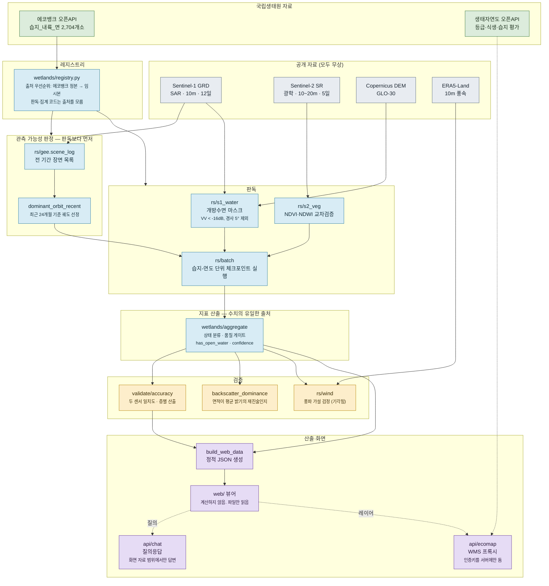
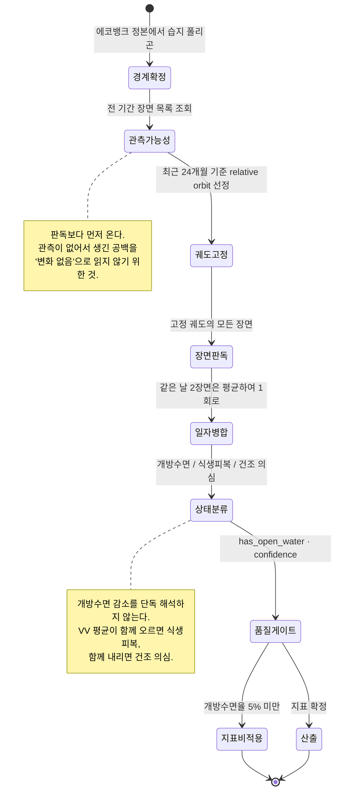

# 에코스코프 — 아키텍처

내륙습지 표면 상태 원격판독 시스템의 설계 정본(Source of Truth)입니다.
이 문서와 코드가 어긋나면 **코드가 맞습니다.**

---

## 0. 이 시스템이 푸는 문제

전국 내륙습지는 **2,704개소**입니다(국립생태원 에코뱅크 `습지_내륙_면`).
현장조사는 주기적으로 순회하는 방식이므로, 특정 습지가 두 조사 사이에 어떤 상태였는지는
기록으로 남지 않습니다. 조사와 조사 사이가 비어 있습니다.

Sentinel-1 위성은 같은 습지를 **12일 간격**으로 관측합니다. C-band 레이더라
장마철·태풍기에도 구름에 막히지 않습니다. 이 시스템은 그 관측을 습지별 시계열로 바꿔,
**현장조사 사이의 공백을 채우는 것**을 목표로 합니다.

### 무엇을 만들지 않았는가

새 위성도, 새 센서도, 새 조사체계도 아닙니다. 이미 공개된 무상 위성자료와
국립생태원이 이미 구축한 습지 공간자료 위에, **판독과 품질관리 계층만** 얹었습니다.

---

## 1. 판독 대상과 산출물

### 판독하는 것

| 산출 | 정의 | 검증 상태 |
|---|---|---|
| **표면 상태** | 관측일별 `개방수면` / `식생피복` / `건조 의심` | 두 센서 판정 일치율 **0.93** |
| **계절 전환** | 개방수면이 식생에 덮이는 시기와 해소 시기 | 광학 NDVI 로 독립 확인 |
| **관측 가능성** | 궤도별 연간 관측 횟수 이력 | 위성 카탈로그 실측 |
| 개방수면 지수 | 그 습지 자신의 전 기간 최대를 100으로 둔 상대값 | 상대 변화만 유효 |

### 판독하지 않는 것

- **수위(수심).** SAR 는 수면의 넓이를 보며 깊이를 보지 않습니다.
- **개방수면 면적(ha)의 절대값.** 검증에 실패했습니다 — §5 참조.
- **식생 하부 침수.** 이중반사 신호가 논의 담수 관리 주기와 같은 대역에서 변동해
  오탐이 심합니다. 근거가 서기 전까지 산출물에 넣지 않습니다.
- **개방수면이 없는 습지의 상태.** 삼림습지·초본습지는 SAR 로 볼 수면이 애초에 없습니다.
  `has_open_water: false` 로 따로 세고 지표를 적용하지 않습니다.

---

## 2. 시스템 구성



### 습지 1개소 · 1개년 처리 흐름



---

## 3. 판독 방법

### 3.1 관측 가능성 판정 (판독보다 먼저)

시계열 비교가 성립하려면 입사각과 관측 geometry 가 같아야 합니다. 서로 다른
relative orbit 의 후방산란은 직접 비교할 수 없으므로, 습지마다 궤도를 하나로 고정합니다.

**그 선택을 분석 구간의 최근 24개월에서 합니다.** 첫 해 기준으로 고르면 이미 소실된
위성의 궤도를 집습니다 — 실제로 그렇게 골랐다가 3개년 판독이 통째로 비었습니다(§5.2).

### 3.2 개방수면 판독

```
water = (VV < -16 dB) AND (지형 경사 < 5°)
```

- 입력: `COPERNICUS/S1_GRD`, IW 모드, VV+VH, 고정 relative orbit
- 스페클 완화: 반경 50 m circle kernel focal median
- 경사 마스크: Copernicus DEM GLO-30. 산지 레이더 그림자를 물로 오인하는 것을 막습니다.
- 같은 날 2장면(프레임 경계에 걸친 습지)은 평균하여 **1회로** 셉니다.

민감도 검사로 장면별 Otsu 임계를 함께 계산해 저장합니다. 두 결과의 괴리가 크면
`confidence: low` 로 표시합니다.

### 3.3 상태 분류

| 상태 | 조건 |
|---|---|
| `open` | 개방수면율이 기준선의 30% 이상 |
| `veg_covered` | 기준선의 30% 미만 **이면서** VV 평균 > −13 dB |
| `dry_suspect` | 기준선의 30% 미만 **이면서** VV 평균 ≤ −13 dB |
| `no_open_water` | 연중 최대 개방수면율 5% 미만 → 지표 비적용 |

기준선은 그 습지·그 해 개방수면율의 90퍼센타일입니다.

**왜 VV 평균을 함께 보는가.** 개방수면이 줄어 보이는 원인은 둘입니다 — 수량이 감소했거나,
식생이 수면을 덮었거나. 수량이 줄면 후방산란도 함께 낮아집니다. 반대로 올라갔다면
수면 위에 산란체가 생긴 것이므로 식생피복으로 판정합니다.

### 3.4 광학 교차검증

같은 폴리곤·같은 기간의 Sentinel-2 NDVI/NDWI 를 붙여 위 해석을 독립적으로 확인합니다.
구름은 SCL 장면분류로 거르고, 유효화소가 부족한 장면은 버립니다.
**비어 있는 것을 채우지 않습니다** — 구름이 걷힌 날이 없으면 그 시기는 값이 없는 것으로 둡니다.

---

## 4. 품질 게이트

산출물에 신뢰할 수 없는 값이 섞이지 않도록 세 가지 게이트를 둡니다.

| 게이트 | 기준 | 목적 |
|---|---|---|
| `has_open_water` | 연중 최대 개방수면율 ≥ 5% **그리고** 최대 개방수면적 ≥ 1 ha | 기준선이 0에 가까운 습지에서 0을 0으로 나누는 것을 막습니다 |
| `confidence` | 고정임계·Otsu 괴리가 최대값의 20% 이하 | 임계 선택에 결과가 흔들리는 습지를 표시합니다 |
| 연도 채택 | 유효 관측 8회 이상 | 표본이 모자란 습지-연도는 지표를 내지 않습니다 |

**저신뢰 판독을 평균에 섞지 않습니다.** 화면에 그대로 표시합니다.

---

## 5. 검증

현장 실측 자료가 없으므로 **독립 센서와의 일치도**로 정확도를 대신합니다.
같은 습지·같은 시기(±3일)를 Sentinel-1 레이더와 Sentinel-2 광학이 각각 관측한 짝을
만들어 비교합니다. 이것이 '정답과의 오차'가 아니라 '두 관측의 불일치'임을 분명히 해 둡니다.

### 5.1 결과 — 상태 판정은 성립, 면적은 실패

습지 8개소, 짝지은 관측 586건 기준입니다.

| 구분 | 표본 | 두 센서 판정 일치율 |
|---|---|---|
| 개방수면 | 379 | **0.926** |
| 식생피복 | 194 | 0.412 |
| 건조 의심 | 13 | 0.615 |

**여러 습지를 묶은 상관(r·R²)은 판독 성능이 아닙니다.** 크기가 다른 습지를 한데 넣으면
"큰 습지는 둘 다 크다"는 사실이 높은 상관으로 나타납니다. 습지별 R² 가 0.00~0.15 인
같은 자료에서 묶은 R² 는 0.932 가 됩니다. 상관은 반드시 `by_wetland` 로 보십시오.

식생피복 구간은 두 센서가 모두 0에 가까워 자동으로 일치합니다.
판정이 실제로 시험되는 곳은 개방수면 구간입니다.

**면적은 검증되지 않았습니다.** 습지별 R² 는 0.00~0.15(중앙값 0.058)이며
임계값을 바꾸어도 달라지지 않습니다 — 임계 선택의 문제가 아닙니다. 원인을 확인한 결과, 개방수면율의 **41~87%** 가
폴리곤 평균 후방산란으로 설명됐습니다. 고정임계로 면적을 내면 밝기 분포가 통째로
이동할 때 임계 아래 화소 비율도 함께 움직입니다. 산출된 면적은 수면의 공간적 범위가
아니라 **그 습지가 전체적으로 얼마나 물처럼 보이는가**의 재진술에 가깝습니다.

풍파 가설(바람이 수면을 거칠게 해 면적이 깎인다)도 검토했으나, 습지별로 상관의 부호가
뒤집혀 기각했습니다. 전체를 묶었을 때의 음의 상관은 습지 간 차이가 만든 허상이었습니다.

**따라서 화면과 산출물은 면적을 측정값으로 제시하지 않습니다.**
같은 습지 안의 상대 지수(전 기간 최대 = 100)로만 표시합니다.

### 5.2 개발 중 발견하여 고친 결함

전문은 [`docs/30_findings.md`](docs/30_findings.md)에 있습니다.

| 결함 | 증상 | 조치 |
|---|---|---|
| 첫 해 기준 궤도 선정 | Sentinel-1B(2021.12 소실) 궤도를 집어 2022~2024 판독이 0건 | 최근 24개월 기준 선정으로 교체 |
| 장면별 Otsu 주지표 사용 | 이질 폴리곤에서 임계가 −14.9~−19.4 dB 로 요동, 면적이 39~123 ha 로 갈림 | 고정임계를 주지표로, Otsu 는 민감도 검사로 강등 |
| 동일 일자 중복 계수 | 프레임 경계 습지에서 연 관측수가 실제의 2배 | 날짜로 묶어 1회로 계수 |
| 개방수면 없는 습지에 지표 적용 | 기준선 0에 가까운 습지에서 무의미한 피복 수치 | `has_open_water` 게이트 도입 |
| 임시 경계 사용 | 판독 성립률 24%. 간척지·시가지를 문 폴리곤 | 에코뱅크 정본 연동 (성립률 75%) |
| 품질 게이트 연도별 판정 | 기준선이 문턱 근처인 습지에서 식생피복이 0%↔79% 로 요동 | 습지 단위 판정으로 교체 |

---

## 6. 자료

| 자료 | 내용 | 좌표계 | 비고 |
|---|---|---|---|
| Sentinel-1 GRD | SAR VV+VH, IW, 10 m / 12일 | — | ESA Copernicus, 무상 |
| Sentinel-2 SR Harmonized | 광학, 10~20 m / 5일 | — | ESA Copernicus, 무상 |
| Copernicus DEM GLO-30 | 지형 경사 | — | ESA, 무상 |
| ERA5-Land HOURLY | 10 m 풍속 (검증용) | — | ECMWF, 무상 |
| 에코뱅크 `습지_내륙_면` | 내륙습지 2,704개소 · 습지명·유형·보호지역 지정 | EPSG:5186 | 국립생태원 오픈API |
| 생태자연도 | 등급·식생·습지 평가등급 | EPSG:5186 | 공공데이터포털 `B553084/ecoapi` |

상용 고해상도 영상은 사용하지 않았습니다.

### 연동 시 확인된 제약

- **에코뱅크 속성조회**는 처리 시간 상한이 약 10초입니다. 페이지가 크면 실패하므로
  5건씩 나누어 받고 진행분을 체크포인트에 기록합니다.
- **에코뱅크 WFS 격자 수집**은 실패합니다. 습지 도형이 매우 상세해(2개소 = 109 KB)
  타일이 커지면 게이트웨이가 500 을 반환합니다. 속성조회 경로를 씁니다.
- **생태자연도는 WFS 만 동작**합니다. WMS·속성조회는 게이트웨이 오류로 응답하지 않습니다.

---

## 7. 통합 규약

### 7.1 수치의 단일 출처

화면에 뜨는 모든 수치는 `src/nie/wetlands/aggregate.py` 한 곳에서 나옵니다.
**화면은 계산하지 않습니다.** 같은 숫자가 두 곳에서 다르게 계산되는 것을 막기 위한 구성입니다.

### 7.2 좌표계

- 판독·집계: EPSG:5179 (면적 산출), EPSG:5186 (에코뱅크 원자료)
- 화면 출력 직전에만 EPSG:4326 으로 재투영
- Google Earth Engine 의 시간 필터는 **UTC** 입니다. KST 로 생각할 때는 반드시
  `gee.kst_window()` 를 거칩니다.

### 7.3 중단 내성

외부 API 와 GEE 는 모두 **중간에 끊기는 것을 정상으로 가정**합니다.

- 배치는 (습지, 연도) 단위로 JSONL 에 즉시 기록하고, 다시 실행하면 끝난 조합을 건너뜁니다.
- 실패한 요청은 시간 간격을 두고 여러 차례 재시도합니다.
- 끝내 받지 못한 항목은 조용히 넘기지 않고 수를 보고합니다.

### 7.4 인증키 취급

인증키는 서버에만 둡니다. 에코뱅크 WMS 는 `serviceKey` 를 URL 쿼리로 받으므로
화면이 타일 주소를 직접 물면 키가 그대로 드러납니다. 화면은 `/map/wms` 프록시만
호출하며, 프록시는 허용 목록에 있는 레이어만 통과시킵니다.

### 7.5 불확실성 표기

- 검증되지 않은 값은 측정값으로 제시하지 않습니다.
- 저신뢰 판독은 감추지 않고 표시합니다.
- 보정되지 않은 임계값은 잠정값임을 명시합니다.
- 관측이 없는 기간은 비워 둡니다. 보간하지 않습니다.

---

## 8. 화면 구성

| 요소 | 내용 |
|---|---|
| 개요 4패널 | 관측 실적 · 판독 대상 · 검증 결과 · 현행 조사 대비 |
| 관측 달력 | 행=습지, 칸=관측 1회, 색=표면 상태. 현행 조사 주기와 나란히 배치 |
| 개방수면 지수 | 선택 습지의 시계열. y축은 전 기간 최대를 100으로 둔 상대 지수 |
| 습지 판독 요약 | 관측 구성·신뢰도 표 + 판독 경계 도면(축척 막대) + 위치 |
| 관측 가능성 | 궤도별 연간 관측 횟수. 끊긴 궤도를 붉게 표시 |
| 안내 서랍 | 판독 방법 · 검증 결과 · 자료 출처 · 판독 한계 |
| 질의응답 | 화면에 실린 판독 결과 범위에서만 답변 |

---

## 9. 배포

정적 화면 + 서버리스 함수 두 개로 구성됩니다.

| 경로 | 기능 |
|---|---|
| `/` | `web/` 정적 자료 (사전 생성 JSON 만 읽음) |
| `/ai/chat` | `api/chat.py` — 질의응답. 근거 묶음을 함께 받아 그 범위에서만 답변 |
| `/map/wms` | `api/ecomap.py` — 에코뱅크 WMS 프록시. 인증키를 서버에 보관 |

서버리스 런타임은 파일시스템이 읽기 전용이므로 `config.py` 는 작업 디렉터리 생성에
실패해도 import 가 죽지 않도록 되어 있습니다. 분석 의존성(geopandas·rasterio·
earthengine-api)은 배포에 포함하지 않습니다 — 두 함수는 표준 라이브러리만 씁니다.
