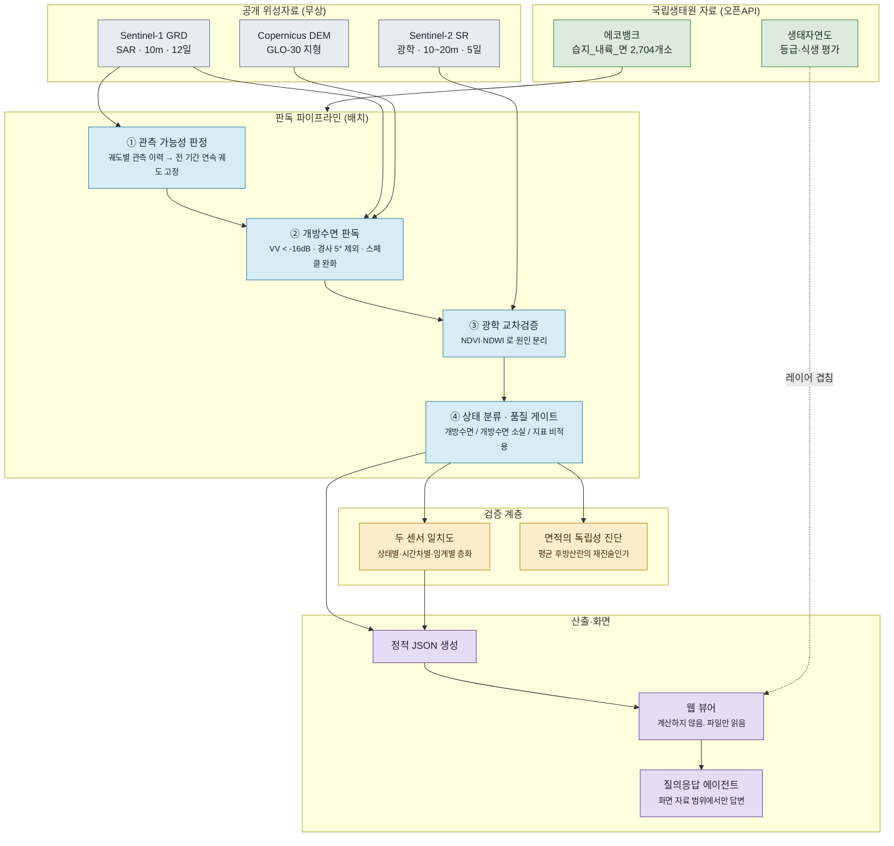

# 에코스코프 — 내륙습지 개방수면 원격판독

전국 내륙습지 2,704개소의 **표면 상태**를 Sentinel-1 위성으로 12일 주기로 판독하여,
「습지보전법」 제4조에 따른 5년 주기 법정조사 사이의 공백을 채우는 생태정보 플랫폼.

**공개 화면 → https://ecoscope-nie.vercel.app**

> 설계 정본(SoT)은 **[ARCHITECTURE.md](ARCHITECTURE.md)** 입니다.
> 판독 방법 명세는 [`docs/10_method.md`](docs/10_method.md),
> 개발 중 확인한 사실과 고친 결함은 [`docs/30_findings.md`](docs/30_findings.md)에 있습니다.

---

## 한 줄 요약

> **"수면적을 재는 시스템"이 아니라 "습지 표면 상태의 계절 전환을 놓치지 않는 시스템".**

국립생태원은 이미 전국 내륙습지 2,704개소의 공간자료를 구축했고 오픈API로 개방하고 있습니다.
Sentinel-1·2 위성자료도 이미 무상 공개되어 있습니다. **자료는 이미 있습니다.**
없는 것은 "그 자료를 습지별 시계열로 바꾸고, 어디까지 믿을 수 있는지 스스로 판정하는"
판독 계층입니다. 이 시스템은 그 계층만 제안합니다 — 새 위성도, 새 조사체계도 아닙니다.

**이 저장소가 가장 공들인 부분은 판독이 아니라 검증입니다.**
독립 센서와 대조한 결과 개방수면 *면적*은 검증에 실패했고, 그 사실을 화면과 문서에
그대로 적었습니다. 무엇을 말할 수 있고 무엇을 말할 수 없는지가 이 시스템의 핵심입니다.

---

## 아키텍처



전체 구성·상태머신·통합 규약은 [ARCHITECTURE.md §2](ARCHITECTURE.md#2-시스템-구성).

---

## 무엇을 판독하는가

| 산출 | 정의 | 검증 상태 |
|---|---|---|
| **표면 상태** | 관측일별 `개방수면` / `개방수면 소실` | 두 센서 판정 일치율 **0.97** |
| **계절 전환** | 개방수면이 식생에 덮이는 시기와 해소 시기 | 광학 NDVI 로 독립 확인 |
| **관측 가능성** | 궤도별 연간 관측 이력 | 위성 카탈로그 실측 |
| 개방수면 지수 | 그 습지 자신의 전 기간 최대를 100으로 둔 상대값 | 상대 변화만 유효 |

### 판독하지 않는 것

- **수위(수심)** — SAR 는 수면의 넓이를 보며 깊이를 보지 않습니다.
- **개방수면 면적(ha)의 절대값** — 검증에 실패했습니다. 아래 참조.
- **식생 하부 침수** — 이중반사 신호가 논의 담수 관리 주기와 같은 대역에서 변동해 오탐이 심합니다.
- **개방수면이 없는 습지의 상태** — 삼림습지·초본습지는 SAR 로 볼 수면이 애초에 없습니다.

---

## 검증 — 무엇이 성립하고 무엇이 실패했는가

현장 실측 자료가 없으므로 **독립 센서와의 일치도**로 정확도를 대신합니다.
같은 습지·같은 시기(±3일)를 Sentinel-1 레이더와 Sentinel-2 광학이 각각 관측한 짝을 만들어
비교했습니다. 습지 **60개소**, 짝지은 관측 **1,075건**입니다.

| 구분 | 표본 | 두 센서 판정 일치율 |
|---|---|---|
| 개방수면 | 1,022 | **0.974** |
| 개방수면 소실 (식생 추정) | 46 | 0.870 |
| 개방수면 소실 (산란체 없음) | 7 | 1.000 |

개방수면 구간의 일치율 **0.974** 가 이 시스템이 실제로 검증한 값입니다.
소실 구간은 두 센서가 모두 0에 가까워 자동으로 일치하는 부분이 섞입니다.

### 면적 — 수준은 맞고, 변동은 못 따라갑니다

낮은 R² 를 곧바로 "면적이 틀렸다"로 읽으면 안 됩니다. R² 는 **변동을 얼마나 설명하는가**라서,
수면 넓이가 연중 거의 변하지 않는 습지에서는 수준이 정확해도 0 에 가깝게 나옵니다.
둘을 갈라 확인했습니다.

| 확인한 것 | 값 | 판정 |
|---|---|---|
| 레이더 평균 / 광학 평균 (중앙) | 1.005 | 치우침 없음 |
| ±10% 안에 드는 습지 | 38 / 60 | 개별 습지는 편차 큼 |
| MAE (수면적 대비, 중앙) | 17.6% | 정밀하지 않음 |
| 습지별 R² (중앙) | 0.068 | 시간 변동은 못 따라감 |

전체로 보면 치우침이 없습니다. 그러나 개별 습지의 수준 오차가 크고, 시간에 따른 증감은
따라가지 못합니다. 60개소 중 R² 0.5 이상은 **9개소**뿐입니다.

| 습지 | 표본 | 면적 R² | MAE (ha) |
|---|---|---|---|
| 주남저수지 | 12 | 0.953 | 8.6 |
| 광천천하구습지 | 11 | 0.928 | 4.1 |
| 낙동강하구 | 127 | 0.088 | 489.3 |
| 해평습지 | 18 | 0.000 | 12.4 |
| 우포늪 | 82 | 0.010 | 79.1 |

> 해평습지를 보십시오. R² 는 0.000 인데 MAE 는 습지 면적의 2.8%, 레이더 평균 219 ha 대
> 광학 평균 216 ha 입니다. **수준은 맞는데 변동이 없어서 R² 가 0 인 경우**입니다.
> R² 하나로 판정하면 이런 습지를 "판독 실패"로 잘못 분류합니다.

> **여러 습지를 묶은 상관은 읽으면 안 됩니다.** 크기가 다른 습지를 한데 넣으면
> "큰 습지는 둘 다 크다"는 자명한 사실이 높은 상관으로 나타납니다.
> 습지별 R² 중앙값이 0.068 인 같은 자료에서, 묶어서 계산하면 **0.955** 가 됩니다.
> 이 값은 판독 성능이 아닙니다. 산출물의 `by_wetland` 를 보십시오.

임계값을 바꾸어도 결과는 달라지지 않습니다 — 임계 선택의 문제가 아닙니다.
원인을 확인한 결과, 개방수면율의 **41~87%** 가 폴리곤 평균 후방산란으로 설명됐습니다.
고정임계로 면적을 내면 밝기 분포가 통째로 이동할 때 임계 아래 화소 비율도 함께 움직입니다.
산출된 면적은 수면의 공간적 범위가 아니라 **그 습지가 전체적으로 얼마나 물처럼 보이는가**의
재진술에 가깝습니다.

풍파 가설(바람이 수면을 거칠게 해 면적이 깎인다)도 세우고 ERA5 풍속으로 검정했으나,
습지별로 상관의 부호가 뒤집혀 **기각**했습니다. 전체를 묶었을 때의 음의 상관(r = −0.37)은
습지 간 차이가 만든 허상이었습니다.

**그래서 화면은 면적을 측정값으로 제시하지 않습니다.** 시계열 y축은 같은 습지 안의
상대 지수(전 기간 최대 = 100)입니다. 근거와 산출 코드는
[ARCHITECTURE.md §5](ARCHITECTURE.md#5-검증) · [`docs/30_findings.md`](docs/30_findings.md) §7.

### 실측 사례 — 우포늪 2024년

여름철 개방수면이 사라지는 것이 가뭄이 아님을 두 센서가 독립적으로 확인합니다.

| 관측일 | 개방수면 | VV 평균 | Sentinel-2 NDVI |
|---|---|---|---|
| 04-12 | 넓음 | −22.3 dB | 0.09 (04-28) |
| 08-10 | 거의 소멸 | **−8.8 dB** | **0.68** (08-11) |
| 11-26 | 회복 | −18.9 dB | 0.06 (11-24) |

수량이 감소했다면 후방산란도 함께 낮아져야 하는데 반대로 **13 dB 상승**했습니다.
같은 시기 광학 NDVI 는 0.09 → 0.68 로 올랐습니다. 수생식물이 수면을 덮은 것입니다.
이 신호는 습지 육상화·천이 모니터링이 필요로 하는 지표에 해당합니다.

---

## 용어

공식 용어와 이 시스템이 판독 결과를 설명하기 위해 정의한 용어를 구분해 적습니다.

### 법령·기관의 공식 용어

| 용어 | 근거 |
|---|---|
| 내륙습지 | 「습지보전법」 제2조 — 육지 또는 섬에 있는 호수·못·늪·하천 또는 하구 |
| 전국내륙습지조사 | 「습지보전법」 제4조에 따른 **5년 주기** 법정조사 (기초조사·정밀조사) |
| 습지보호지역 | 「습지보전법」 제8조 |
| 하천습지·호수습지·산지습지·인공습지 | 국립생태원 습지 유형 분류 |
| 생태자연도 | 「자연환경보전법」에 따른 등급도 |

### 이 판독의 조작적 용어

아래는 **법령이나 국립생태원 습지 유형 분류의 공식 명칭이 아닙니다.**
판독 결과를 가리키기 위해 이 시스템이 정의해 사용하는 표현입니다.

| 용어 | 이 시스템에서의 정의 |
|---|---|
| **개방수면** | 식생에 덮이지 않아 위성 레이더에 매끈한 면으로 관측되는 수면. 영어 *open water* 에 대응합니다. VV 후방산란 −16 dB 미만이고 지형 경사 5° 이하인 화소를 말합니다. |
| **개방수면 소실** | 개방수면이 그 습지 기준선의 30% 미만으로 줄어든 관측. **측정한 것은 여기까지이며 원인은 포함하지 않습니다.** VV −13 dB 로 식생/건조를 가르는 구분은 전국 자료에서 특이도 0.10 에 그쳐 실험 항목으로 내렸습니다(`docs/30_findings.md` §10). |
| **건조 의심** | 개방수면이 줄었으나 VV 평균도 함께 낮은 관측. 수면과 산란체가 모두 확인되지 않는 상태입니다. **가뭄 판정이 아닙니다.** |
| **지표 비적용** | 연중 최대 개방수면율이 5% 미만이어서 개방수면 지표를 적용하지 않은 습지. |
| **개방수면 지수** | 그 습지 자신의 전 기간 최대 개방수면율을 100으로 둔 상대값. 면적이 검증되지 않았으므로 절대값 대신 씁니다. |
| **관측 가능성** | 궤도별 연간 관측 횟수 이력. 관측 공백을 '변화 없음' 으로 읽지 않기 위해 판독보다 먼저 확인합니다. |

**표기 원칙.** 판정 결과를 법령상 상태로 옮겨 적지 않습니다.
'건조 의심' 은 관측 상태의 이름이지 습지의 상태를 확정한 것이 아니며,
'개방수면 소실' 은 습지 훼손이나 육상화가 진행됐다는 판정이 아닙니다.

---

## 구현 상태 — Implemented / Experimental / Rejected

> **"코드가 동작한다"와 "성능이 검증됐다"는 다릅니다.** 아래 표는 그 구분을 명시합니다.

| 기능 | 상태 | 근거 / 남은 것 |
|---|---|---|
| 에코뱅크 정본 습지 경계 연동 | ✅ Implemented | 2,704개소 중 2,479개소 수집. 습지명·유형·보호지역 지정 포함 |
| 관측 가능성 판정 (궤도 선정) | ✅ Implemented | Sentinel-1B 소실 궤도 회피 검증. 궤도별 연간 이력을 산출물로 보관 |
| Sentinel-1 개방수면 판독 | ✅ Implemented | 2018~2025년 실관측 처리. 체크포인트 재개 지원 |
| Sentinel-2 광학 교차검증 | ✅ Implemented | NDVI·NDWI + 구름 마스크. 결측을 보간하지 않음 |
| 상태 분류 (개방수면 / 소실) | ✅ Implemented | **두 센서 일치율 0.974** (개방수면 구간, n=1,022 · 습지 60개소) |
| 품질 게이트 (`has_open_water`·`confidence`) | ✅ Implemented | 지표 비적용 습지를 별도 집계. 저신뢰를 화면에 표시 |
| 정확도 산출 프레임 | ✅ Implemented | 상태별·시간차별·임계별 층화 산출. `scripts/run_validation.py` 로 재현 |
| **개방수면 면적(ha) 절대값** | ⚠️ **부분 성립** | 수준은 치우침 없음(평균비 1.005)이나 개별 오차 큼(수면적의 17.6%). 시간 변동 미추적(습지별 R² 중앙 0.068). **측정값으로 제시하지 않음** |
| 풍파 보정 | ❌ **가설 기각** | 습지별 상관 부호가 뒤집힘. VV 통제 후 편상관 −0.14. `scripts/run_wind_check.py` |
| 소실 원인 판정 (VV −13 dB) | ❌ **검증 실패** | 전국 자료에서 특이도 0.10 · Youden J 0.085. 주지표를 **개방수면 소실 비중**으로 교체하고 원인 구분은 실험 항목으로 강등 |
| 생태자연도 연계 | 🧪 Experimental | WFS 동작 확인. WMS·속성조회는 제공기관 게이트웨이 오류 |
| 습지별 생태자연도 등급 집계 | ✅ Implemented | 정본 경계 기준 60개소. 등급별 합집합으로 산출해 피복률 초과 0건. 등급 코드 9 는 자료로 추정 |
| 질의응답 에이전트 | ✅ Implemented | 화면 자료를 근거로 전달. 서버 미연결 시 내장 응답기로 전환 |
| WMS 프록시 (인증키 보호) | ✅ Implemented | 허용 레이어 목록 제한. 배포 환경 동작 확인 |
| 전국 확대 판독 | ✅ Implemented | 호수·하천습지 30 ha 이상 489개소 완료. 산지·인공습지는 범위 밖 |
| 품질 게이트 습지 단위 판정 | ✅ Implemented | 연도별 판정 시 기준선이 문턱 근처인 습지에서 값이 튀던 결함 수정 |

---

## 판독 실적

`web/data/summary.json` 기준이며, 화면 상단에 자료 생성일이 표시됩니다.

| 항목 | 값 |
|---|---|
| 판독 기간 | 2018~2025년 (8개년) |
| 판독 습지 | **466개소** (습지-연도 522건) |
| 처리한 SAR 관측 | **15,637회** |
| 평균 재방문 주기 | 12.3일 |
| 개방수면 지표 성립 | **351개소** (75%) · 고신뢰 353 습지-연도 |
| 개방수면 소실 관측 습지 | **130개소** |
| 정본 습지 적재 | 2,479 / 2,704개소 |

정본 유형 구성: 하천습지 1,223 · 호수습지 574 · 산지습지 415 · 인공습지 267.

전국 스크리닝은 경계가 뚜렷한 호수·하천형 30 ha 이상 489개소를 2025년 1개년으로 돌리고,
그중 8개소를 2018~2025년 다년으로 정밀 판독했습니다.
Sentinel-2 광학 교차검증은 개방수면 지표가 성립한 습지 **60개소**(짝지은 관측 1,075건)에서
수행했습니다.

**대상 선정 기준.** 이 판독법은 경계가 뚜렷한 호수·하천형 습지에서 성립합니다.
늪·소택형은 개방수면이 정수식생으로 연속적으로 이어져 그을 경계가 없으므로 제외합니다
([ARCHITECTURE.md §1](ARCHITECTURE.md#1-판독-대상과-산출물)).

---

## 저장소 구조

```
README.md                    # 이 파일
ARCHITECTURE.md              # 설계 정본 (SoT)
docs/
  10_method.md               # 판독 방법 명세 (파라미터·정의)
  30_findings.md             # 개발 중 확인한 사실과 고친 결함
src/nie/
  config.py                  # 경로·환경변수 단일 지점
  rs/
    gee.py                   # GEE 헬퍼 · KST↔UTC · 궤도 선정 · 장면 목록
    s1_water.py              # Sentinel-1 개방수면 판독 (고정임계 + Otsu 민감도)
    s2_veg.py                # Sentinel-2 NDVI·NDWI · 광학 수면 면적
    wind.py                  # ERA5 풍속 (풍파 가설 검정용)
    batch.py                 # 습지-연도 단위 체크포인트 배치 실행
  wetlands/
    registry.py              # 습지 레지스트리 (출처 우선순위 · 스키마 통일)
    aggregate.py             # 지표 산출 — 화면 수치의 유일한 출처
    osm.py                   # 임시 경계 수집 (정본 부재 시 부트스트랩)
  ecobank/client.py          # 에코뱅크 오픈API 어댑터 (WFS·WMS·속성조회)
  ecomap/client.py           # 생태자연도 오픈API 어댑터 (WFS)
  validate/accuracy.py       # 두 센서 일치도 · 면적 독립성 진단 · 편상관
scripts/
  fetch_wetlands_ecobank.py  # 정본 습지 경계 수집 (체크포인트)
  run_water_batch.py         # 판독 배치 (유형·면적·연도 지정)
  run_validation.py          # 정확도 산출
  run_wind_check.py          # 풍파 가설 검정
  build_web_data.py          # 화면용 정적 JSON 생성
  probe_ecobank.py           # 인증키·레이어 동작 진단
api/
  chat.py                    # 질의응답 서버리스 함수
  ecomap.py                  # 에코뱅크 WMS 프록시 (인증키 보호)
web/                         # 화면 — 사전 생성 파일만 읽음
data/                        # 원자료·중간산출물 (저장소에 포함하지 않음)
```

---

## 실행

```bash
pip install -r requirements.txt
cp .env.example .env          # EE_PROJECT 및 오픈API 인증키 기입
earthengine authenticate
```

```bash
# 1. 정본 습지 경계 수집 (체크포인트 — 중단되면 같은 명령으로 재개)
python scripts/fetch_wetlands_ecobank.py

# 2. 판독 배치 — 경계가 뚜렷한 유형만, 30 ha 이상
python scripts/run_water_batch.py --types "호수습지,하천습지" --min-area 30 \
       --years 2025 --out nie2025.jsonl

#    특정 습지를 다년·광학 포함으로 정밀 판독
python scripts/run_water_batch.py --wids "<습지코드,...>" --years 2018-2025 \
       --optical --out deep.jsonl

# 3. 검증
python scripts/run_validation.py --top 12      # 두 센서 일치도
python scripts/run_wind_check.py --top 6       # 풍파 가설 검정

# 4. 화면 자료 생성 후 확인
python scripts/build_web_data.py nie2025.jsonl deep.jsonl
python -m http.server 5178 --directory web
```

모든 배치는 (습지, 연도) 단위로 진행분을 기록합니다. 중단되어도 같은 명령으로 이어받습니다.

---

## 기술 스택

Google Earth Engine(위성 판독) · GeoPandas·Shapely(공간 처리) · Python 표준 라이브러리
(오픈API 어댑터·서버리스 함수) · 순수 SVG 뷰어(외부 지도 라이브러리 없음) ·
Vercel(정적 배포 + 서버리스 함수) · Gemini(질의응답).

화면은 계산하지 않습니다. `scripts/build_web_data.py` 가 생성한 정적 JSON 만 읽습니다.
서버리스 함수 두 개는 표준 라이브러리만 사용하므로 분석 의존성을 배포에 포함하지 않습니다.

---

## 자료 출처

| 자료 | 제공 |
|---|---|
| Sentinel-1 GRD · Sentinel-2 SR · Copernicus DEM | ESA Copernicus |
| ERA5-Land | ECMWF |
| 습지_내륙_면 (내륙습지 2,704개소) | 국립생태원 에코뱅크 오픈API |
| 생태자연도 | 공공데이터포털 국립생태원_생태자연도 서비스 |

수집·가공하는 공공데이터의 원 권리는 각 제공기관에 있습니다.
화면에는 자료 출처와 판독 방법, 그리고 **검증되지 않은 항목**을 항상 함께 표시합니다.
